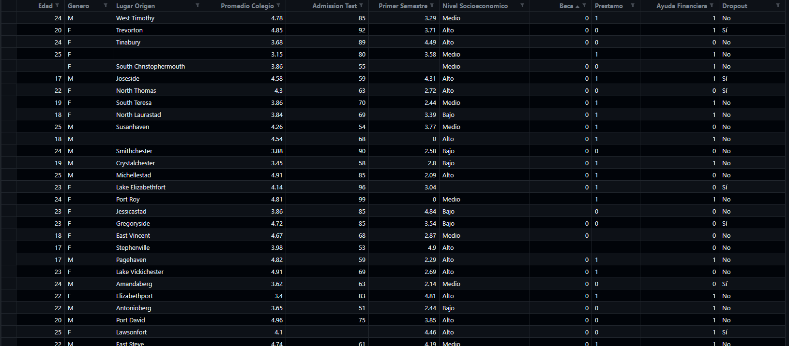

# **Dataset Sintético – Predicción de Deserción Estudiantil**

## **Descripción**

Este dataset simula información de estudiantes de la Universidad de la Costa con el objetivo de predecir la **deserción en el primer año** usando Machine Learning.
Contiene datos **demográficos, académicos y financieros**, junto con la variable objetivo `Dropout` (Sí/No).

---

## **Número de registros**

* 500 registros simulados.

---

## **Variables**

| Variable            | Tipo       | Descripción                       | Rango / Valores                          |
| ------------------- | ---------- | --------------------------------- | ---------------------------------------- |
| Edad                | Numérica   | Edad del estudiante               | 17 a 25 años                             |
| Genero              | Categórica | Sexo del estudiante               | 'M', 'F'                                 |
| LugarOrigen         | Categórica | Ciudad de procedencia             | Nombre de ciudad generado aleatoriamente |
| PromedioColegio     | Numérica   | Promedio de notas en colegio      | 3.0 a 5.0 (algunos outliers = 6.0)       |
| AdmissionTest       | Numérica   | Resultado del examen de admisión  | 50 a 100                                 |
| PrimerSemestre      | Numérica   | Nota promedio del primer semestre | 2.0 a 5.0 (algunos outliers = 0.0)       |
| NivelSocioeconomico | Categórica | Nivel socioeconómico              | 'Bajo', 'Medio', 'Alto'                  |
| Beca                | Binaria    | Recibe beca                       | 0 = No, 1 = Sí                           |
| Prestamo            | Binaria    | Tiene préstamo estudiantil        | 0 = No, 1 = Sí                           |
| AyudaFinanciera     | Binaria    | Recibe ayuda financiera adicional | 0 = No, 1 = Sí                           |
| Dropout             | Categórica | Deserción del estudiante          | 'Sí', 'No'                               |

---

## **Valores nulos**

* Se introdujeron **valores nulos aleatorios** en aproximadamente el 5% de los registros de cada variable (excepto la variable `Dropout`) para simular datos incompletos.

---

## **Outliers**

* Se introdujeron **outliers en las variables académicas**:

  * `PromedioColegio` = 6.0 (fuera del rango normal de 3-5)
  * `PrimerSemestre` = 0.0 (fuera del rango normal de 2-5)
* Esto simula errores de registro o datos extremos en la vida real.

---

## **Uso del dataset**

* Este dataset puede utilizarse para entrenar y probar modelos de **Machine Learning supervisado** para **clasificación binaria** (predecir si un estudiante desertará o no).
* Ideal para experimentos de **Random Forest, Logistic Regression, Decision Trees**, entre otros.

---

## **Generación del dataset**

El dataset fue generado usando Python con las librerías `pandas`, `numpy` y `faker`.
El código completo se encuentra en el archivo `dataset_sintetico_dropout.py`.

---

## **Licencia**

* Uso académico y de práctica. No para fines comerciales.

---

Si quieres, puedo armar **una versión “lista para GitHub” con formato Markdown más atractivo**, incluyendo **badges, ejemplo de vista previa de los datos y link al CSV**, para que tu repositorio se vea profesional.

¿Quieres que haga eso?
